# 一日三检自动打卡

> `一日三检`和`晚点名`是不是很烦 ,你们是不是想打死那个每天都@所有人的群主? 
> 诶，别别别，都是打工人，打工人何必为难打工人呢。所以今天我来教大家怎么实现自动打卡。
> 如果你只是`懒狗`单纯就是不想打卡，请看`使用篇`。
> 如果你是`考究怪`既想不用打卡的同时，又想知道实现原理，请看`原理篇`。


## 使用篇

### 初级懒狗

你要学会**两件事**

1. 学会使用fiddler抓包 。

2. 每三天抓一次包并登录http://106.52.132.89:7070/#/login 自行更新。

> 这时你可能会吐槽了，我都做懒狗了，你tm还想让我学抓包，还要每三天给你抓一次，溜了溜了。相信我兄弟(姐妹)，跟着步骤来5分钟上手，而且一天抓包，还三天清净他不香么。至于为啥是三天呢，因为token值是会`失效`的,当你手机提醒你打卡或者晚签到的时候就是你的token失效。


#### Fiddler抓包过程

##### 1.下载安装

* [Fiddler英文版](https://pc.qq.com/detail/10/detail_3330.html)

* [Fiddler汉化版 v5.0绿色版](https://www.xiazai99.com/down/soft83364.html) 

> 建议下载英文版，汉化版如果安装不小心，会装到流氓软件的，有个憨憨师妹就中招了（笑）


##### [2.Fiddler配置](https://www.cnblogs.com/woaixuexi9999/p/9247705.html)

打开Fiddler  Tool->Fiddler Options->HTTPS 。 

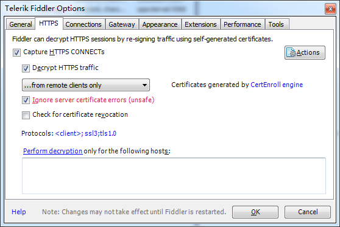


选中`"Decrpt HTTPS traffic"`,   Fiddler就可以截获HTTPS请求，`第一次会弹出证书安装提示`，若没有弹出提示，勾选Actions-> Trust Root Certificate

另外，如果你要监听的程序访问的 HTTPS 站点使用的是不可信的证书，则请接着把下面的 `“Ignore servercertificate errors” `勾选上。


证书安装提示：

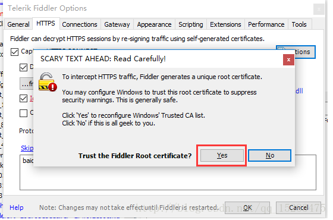


`点击Yes`，留意一下红框里面的内容，DO_NOT_TRUST_FiddlerRoot ,这个就是证书的名称。 

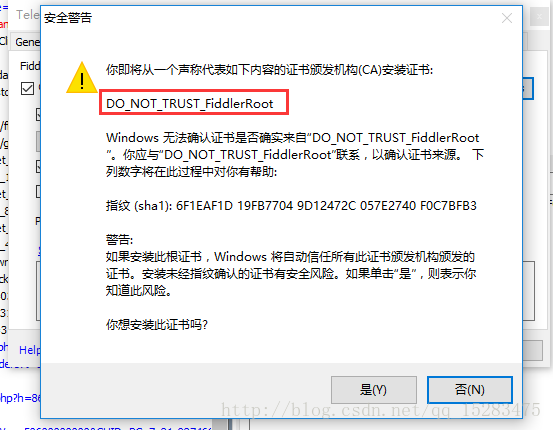

`点击是`。 


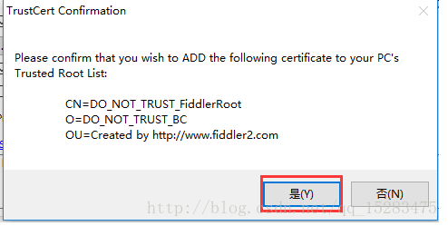


`点击是`，这样Fiddler证书就已经添加成功了。

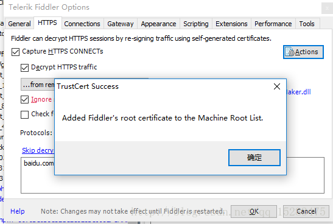


##### 3.重启Fiddler

##### 4.电脑登录微信

##### 5.抓包

1. 打开Fiddler 如果左边面板的会话比较多的话 使用 `ctrl+x` 就可以清空面板。

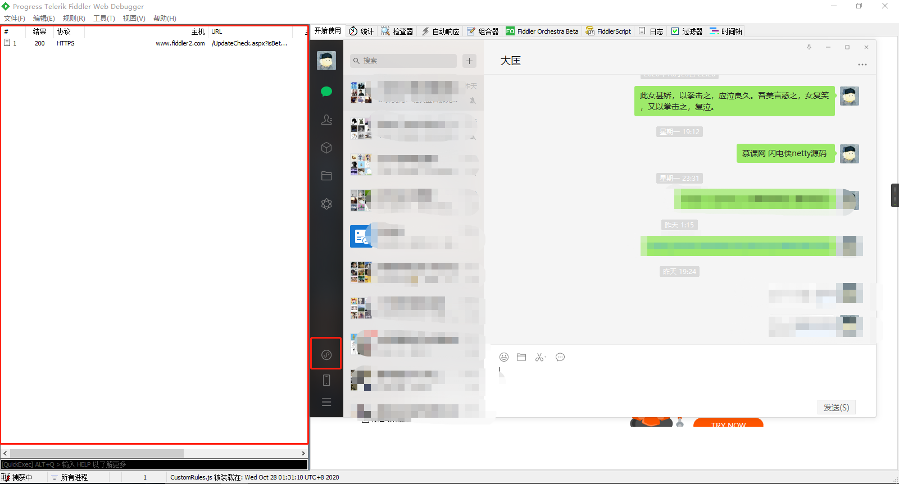


2. 打开微信小程序 我在校园 ，此时左边面板出现新的会话 ，这个就是小程序的https请求

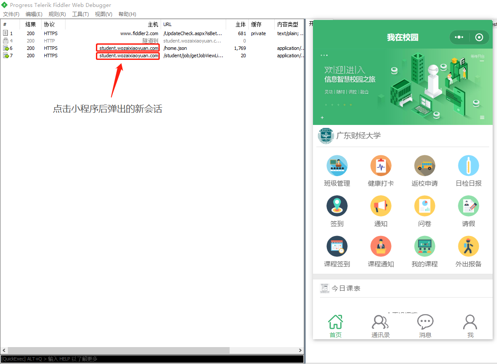


3. 随便点击一个新会话 ，复制右边的token值` token: ad4937c7-9934-4317-81ea-9351b40b5657`

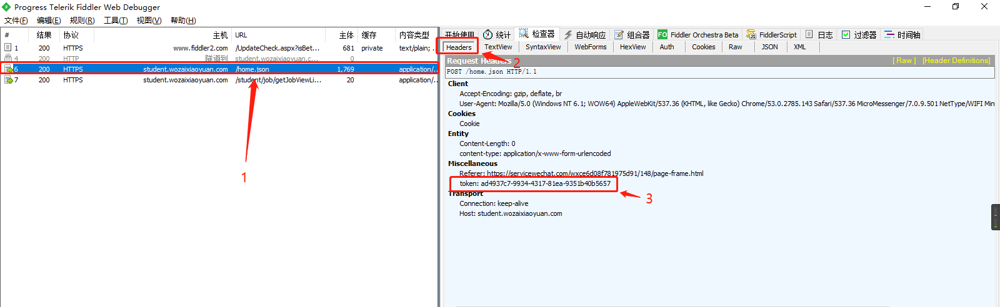


如果抓过效果跟上图一致，请直接跳到`第六步`

如果你抓包没有上图效果的话， 按`win+r`键 输入`certmgr.msc`

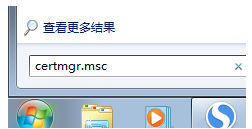

进入证书管理中心

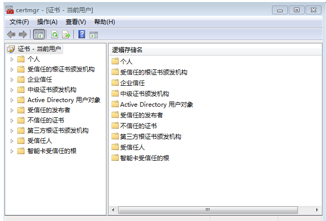

点击操作--查找证书，如下所示：

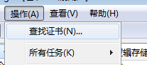


 然后输入fiddler查找所有相关证书，如下所示：

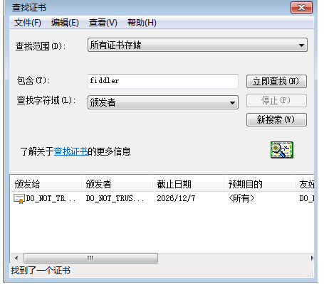


可以看到，我们找到`一个`，您可能会找到`多个`，不要紧，`有多少个删多少个`，分别右键--删除这些证书，如下所示：全删之后，这一步完成。

接下来下载证书`fiddlercertmaker.exe`

**以下是链接，可以直接上官网下载**

链接：https://pan.baidu.com/s/1a6UbCNougvAfUx-2tnim9A

提取码：7uze


下载完成之后双击打开直到报completed，然后点击确定，关掉它。

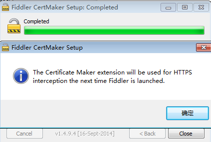


回到Fiddler 点击https页面，勾选`dycrypt httos traffc`

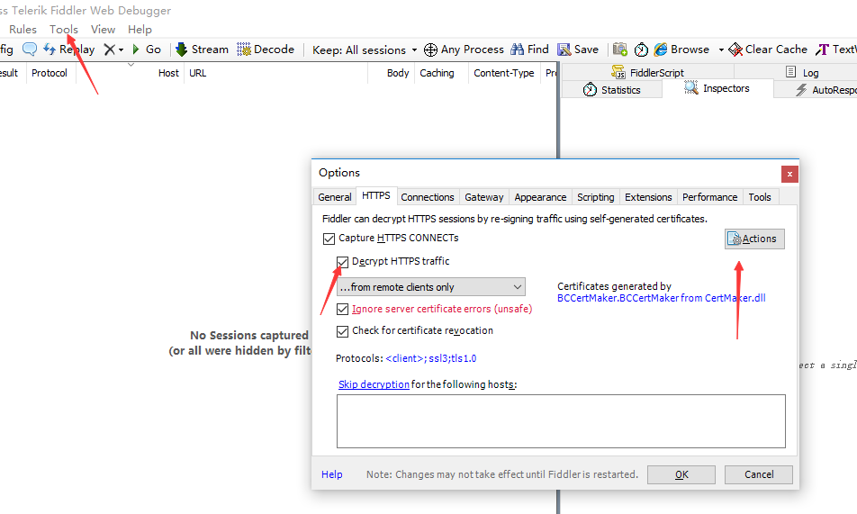

点击action—trust root ….，然后点是开始安装根证书。

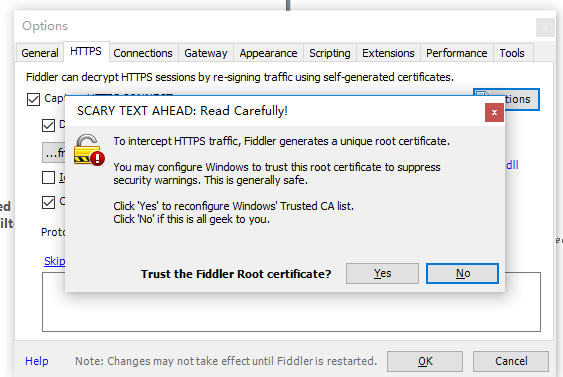

再`重启Fiddler` 再`打开小程序` 


以上抓包步骤参考自：https://www.cnblogs.com/ww-xiaowei/p/11956478.html


##### 6.打开浏览器

`访问`：http://106.52.132.89:7070/#/login

`注册`： 输入账号  姓名 密码  密码随便设，记得住就行，数据库没做加密处理，

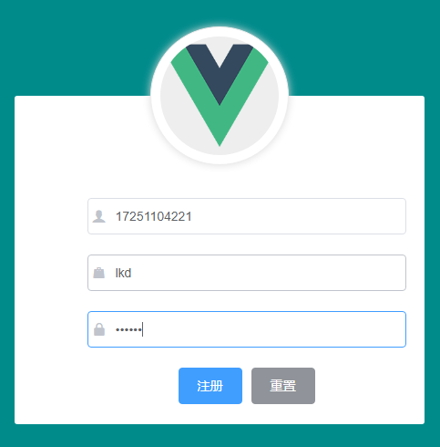

`登录并更新`： 输出 账号 密码 token值 

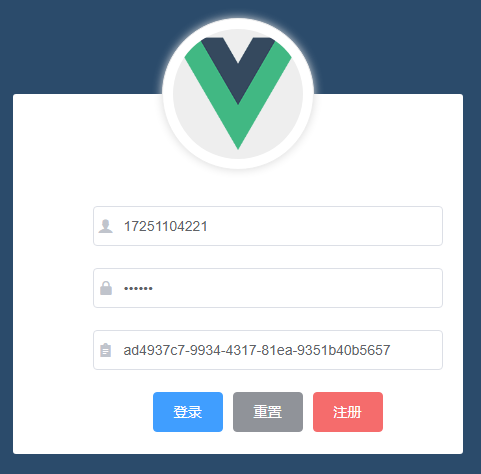


这样你作为初级懒狗的身份就结束了，后续服务器会为你自动打卡和晚签到。


### 高级懒狗

> 看到这里，你注定与初级懒狗不同，你觉得抓个包很简单没意思，教练我想.....。别想了，教练教你就是。


[项目源码](https://github.com/Duangdi/fuck-wozaixiaoyuan)  

> `Fork`的同时 别忘了点个`Star`  怎么`Clone` 不用我教了吧。


#### 1.导入项目


[如何通过 IDEA 导入一个 SPRINGBOOT 项目](https://how2j.cn/k/springboot/springboot-import-idea/1920.html)


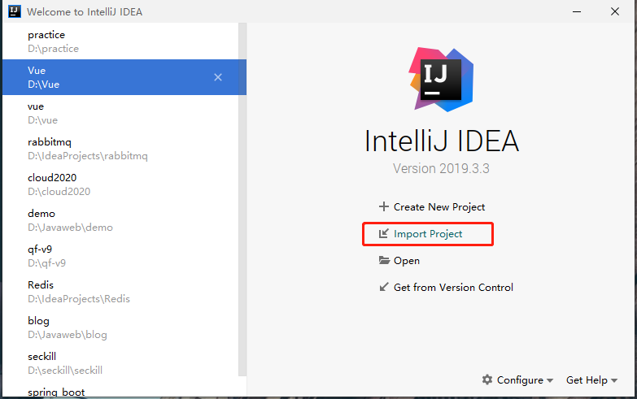


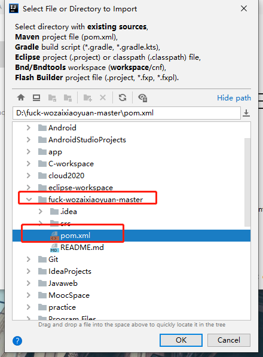


[IntelliJ IDEA : .java文件 左下角显示“J”图标及解决方案](https://blog.csdn.net/weixin_42740530/article/details/83783436)


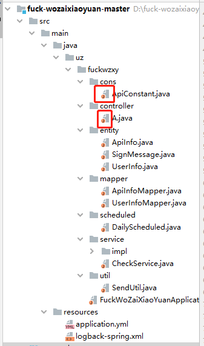


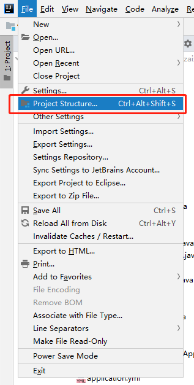


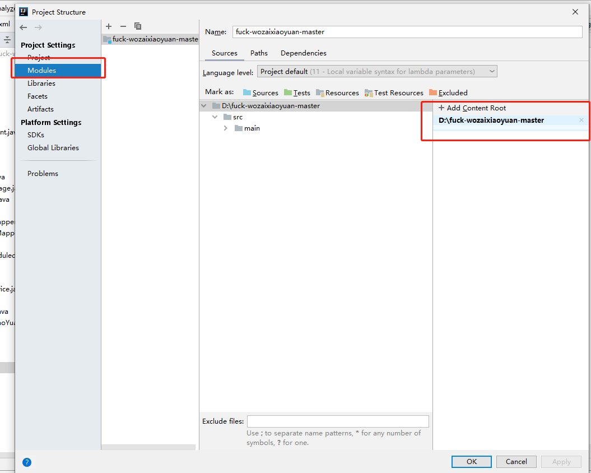


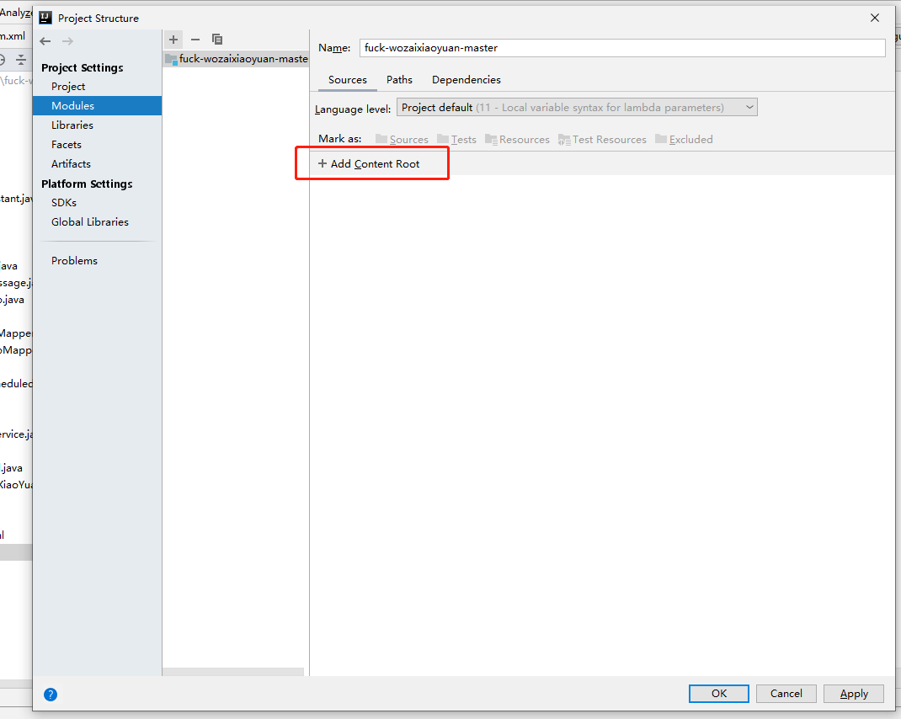


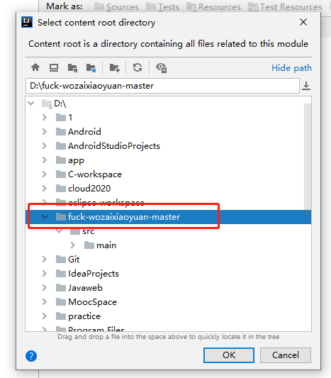


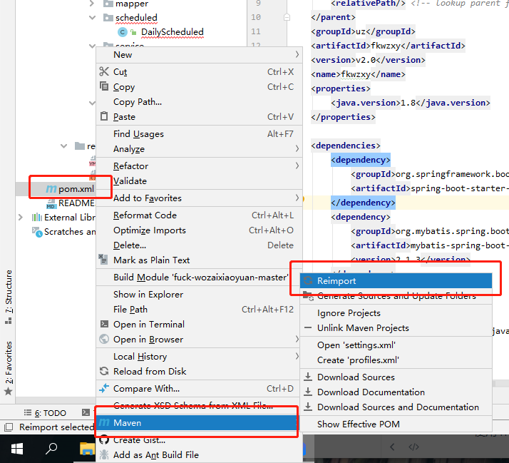


#### 2.导入数据库

```sql
SET NAMES utf8mb4;
SET FOREIGN_KEY_CHECKS = 0;

-- ----------------------------
-- Table structure for api_info
-- ----------------------------
DROP TABLE IF EXISTS `api_info`;
CREATE TABLE `api_info`  (
  `id` int NOT NULL AUTO_INCREMENT,
  `method` int NULL DEFAULT NULL COMMENT '请求方法  0get1post',
  `url` varchar(255) CHARACTER SET utf8mb4 COLLATE utf8mb4_general_ci NULL DEFAULT NULL COMMENT '地址',
  `name` varchar(255) CHARACTER SET utf8mb4 COLLATE utf8mb4_general_ci NULL DEFAULT NULL COMMENT '名字',
  `contenttype` varchar(255) CHARACTER SET utf8mb4 COLLATE utf8mb4_general_ci NULL DEFAULT NULL COMMENT '服务端发送的类型及采用的编码方式',
  `body` varchar(500) CHARACTER SET utf8mb4 COLLATE utf8mb4_general_ci NULL DEFAULT NULL COMMENT '方法体',
  PRIMARY KEY (`id`) USING BTREE
) ENGINE = InnoDB AUTO_INCREMENT = 8 CHARACTER SET = utf8mb4 COLLATE = utf8mb4_general_ci ROW_FORMAT = DYNAMIC;

-- ----------------------------
-- Records of api_info
-- ----------------------------
INSERT INTO `api_info` VALUES (1, 1, 'https://student.wozaixiaoyuan.com/heat/save.json', '三检接口', 'application/x-www-form-urlencoded', 'answers=%5B%220%22%5D&seq=3&temperature=36.4&userId=&latitude=23.084003&longitude=113.317412&country=%E4%B8%AD%E5%9B%BD&city=%E5%B9%BF%E5%B7%9E%E5%B8%82&district=%E6%B5%B7%E7%8F%A0%E5%8C%BA&province=%E5%B9%BF%E4%B8%9C%E7%9C%81&township=%E6%B1%9F%E6%B5%B7%E8%A1%97%E9%81%93&street=%E4%B8%8A%E5%86%B2%E4%B8%AD%E7%BA%A6%E6%96%B0%E8%A1%97%E4%B8%80%E5%B7%B7&myArea=');
INSERT INTO `api_info` VALUES (2, 1, 'https://student.wozaixiaoyuan.com/heat/getTodayHeatList.json', '三检状况', 'application/x-www-form-urlencoded', NULL);
INSERT INTO `api_info` VALUES (3, 1, 'https://student.wozaixiaoyuan.com/sign/getSignMessage.json', 'getSignMessage', 'application/x-www-form-urlencoded', NULL);
INSERT INTO `api_info` VALUES (4, 1, 'https://student.wozaixiaoyuan.com/sign/doSign.json', 'doSign', 'application/json', NULL);
INSERT INTO `api_info` VALUES (5, 1, 'https://student.wozaixiaoyuan.com/heat/getHeatUsers.json', '获取班级未打卡名单', 'application/x-www-form-urlencoded', 'seq=3&date=20201030&type=0');
INSERT INTO `api_info` VALUES (6, 1, 'https://student.wozaixiaoyuan.com/heat/save.json', '代打卡', 'application/x-www-form-urlencoded', 'answers=%5B%220%22%5D&seq=&temperature=36.4&userId=&latitude=&longitude=&country=%E4%B8%AD%E5%9B%BD&city=%E5%B9%BF%E5%B7%9E%E5%B8%82&district=%E6%B5%B7%E7%8F%A0%E5%8C%BA&province=%E5%B9%BF%E4%B8%9C%E7%9C%81&township=&street=&myArea=');
INSERT INTO `api_info` VALUES (7, 1, 'https://student.wozaixiaoyuan.com/heat/getTodayHeatList.json', '判断token是否有效', 'application/x-www-form-urlencoded', NULL);

-- ----------------------------
-- Table structure for user_info
-- ----------------------------
DROP TABLE IF EXISTS `user_info`;
CREATE TABLE `user_info`  (
  `id` varchar(255) CHARACTER SET utf8mb4 COLLATE utf8mb4_general_ci NOT NULL DEFAULT '',
  `name` varchar(255) CHARACTER SET utf8mb4 COLLATE utf8mb4_general_ci NOT NULL,
  `password` varchar(255) CHARACTER SET utf8mb4 COLLATE utf8mb4_general_ci NOT NULL,
  `token` varchar(255) CHARACTER SET utf8mb4 COLLATE utf8mb4_general_ci NULL DEFAULT NULL,
  `status` int NULL DEFAULT 0,
  PRIMARY KEY (`id`) USING BTREE
) ENGINE = InnoDB CHARACTER SET = utf8mb4 COLLATE = utf8mb4_general_ci ROW_FORMAT = DYNAMIC;
```


#### 3.本地测试

本地测试api接口，需要装`RestfulToolkit `插件,然后运行springboot项目

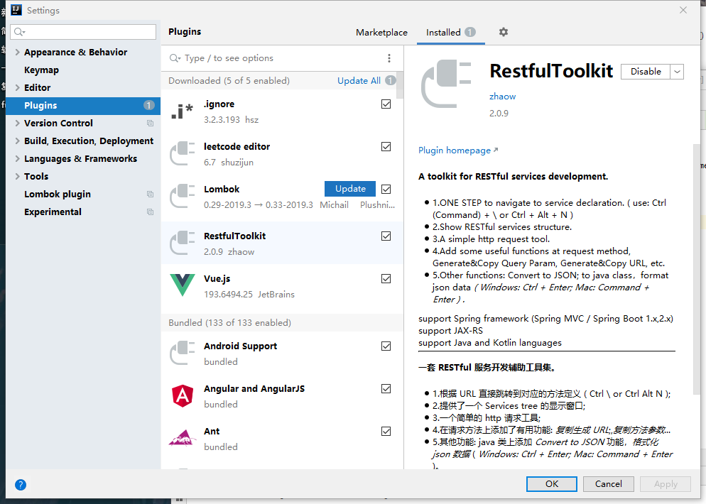


#### 4.vue项目部署服务器

要嫌vue部署麻烦，完全可以，同学抓完token后发给你，手动插入数据库更新，但是后面估计很多人找你会更麻烦。

教学视频：https://www.bilibili.com/video/BV1EE411B7SU?p=205


**通过node创建web服务器**

创建新文件 `wzxy_server` 

执行命令   创建node项目

安装 express  

将`dist`放进`wzxy_server` 

创建`app.js`文件

```js
const express = require('express')
// 创建 web服务器
const app = express()

// 托管静态资源
app.use(express.static('./dist'))

// 启动 web 服务器
app.listen(7070,() =>{
	console.log('server running at http://127.0.0.1')
})
```


 [linux 下安装 node](https://blog.csdn.net/jiangyu1013/article/details/80980765)

```shell
#用 epel 的来安装 node 
sudo yum install epel-release
sudo yum install nodejs
node --version

#安装 npm 和 express
sudo yum install npm --enablerepo=epel
sudo npm install -g express
sudo npm install -g express-generator
```


[nohup 后台运行命令（关闭shell也不会终止）](https://blog.csdn.net/zou79189747/article/details/81366265)

```shell
[root@VM_0_5_centos ~]# unzip -n wzxy_server.zip -d  /root/wzxy_server
[root@VM_0_5_centos ~]# cd wzxy_server/
[root@VM_0_5_centos wzxy_server]# nohup node ./app.js &
[1] 22175
[root@VM_0_5_centos wzxy_server]# nohup: ignoring input and appending output to ‘nohup.out’

[root@VM_0_5_centos wzxy_server]# exit
logout

```


#### 5.springboot部署服务器


ps: 之前已上线过 现在下线 并重新部署

```shell
[root@VM_0_5_centos ~]# ps -ef | grep java
root     20468 11611 99 12:48 pts/0    00:00:02 java -jar /usr/fkwzxy/fuckwzxy-0.0.1-SNAPSHOT.jar
root     20487 11611  0 12:48 pts/0    00:00:00 grep --color=auto java
root     31289     1  0 02:02 ?        00:00:45 java -jar /usr/myrecruit/my-recruit-my-recruit-0.0.1.jar
[root@VM_0_5_centos ~]# kill -9 20468
[root@VM_0_5_centos ~]# nohup java -jar /usr/fkwzxy/fuckwzxy-0.0.1-SNAPSHOT.jar &
[2] 21451
[1]   Killed                  nohup java -jar /usr/fkwzxy/fuckwzxy-0.0.1-SNAPSHOT.jar
[root@VM_0_5_centos ~]# nohup: ignoring input and appending output to ‘nohup.out’

[root@VM_0_5_centos ~]# ps -ef | grep java
root     21451 11611 99 12:53 pts/0    00:00:03 java -jar /usr/fkwzxy/fuckwzxy-0.0.1-SNAPSHOT.jar
root     21476 11611  0 12:53 pts/0    00:00:00 grep --color=auto java
root     31289     1  0 02:02 ?        00:00:46 java -jar /usr/myrecruit/my-recruit-my-recruit-0.0.1.jar
```


## 原理篇

### 我在校园接口文档（待完善）

**接口说明**

- 接口基准地址：`https://student.wozaixiaoyuan.com/`
- API 认证统一使用 Token 认证
- 使用 HTTP Status Code 标识状态
- 数据返回格式统一使用 JSON


#### 1.获取三检信息接口

- 请求路径：heat/getTodayHeatList.json
- 请求方法：post
- 请求参数


#### 2.进行三检接口

- 请求路径：heat/save.json
- 请求方法：post
- 请求参数：

| 参数名      | 参数说明 | 备注                       |
| ----------- | -------- | -------------------------- |
| answers     | 健康状况 | ["0"] 无下列情况，身体健康 |
| seq         | 序列号   | 1：晨检 2：午检 3：晚检    |
| temperature | 当前体温 | 默认36.4                   |
| userId      | 用户Id   | 为空                       |
| latitude    | 经度     | 默认23.084003              |
| longitude   | 纬度     | 默认113.317412             |
| country     | 国家     | 默认中国                   |
| city        | 城市     | 默认广州市                 |
| district    | 地区     | 默认海珠区                 |
| province    | 省份     | 默认广东省                 |
| township    |          | 默认江海街道               |
| street      | 街道     | 默认上冲中约新街一巷       |
| myArea      | 范围     | 为空                       |

- 响应参数

| 参数名 | 参数说明   | 备注      |
| ------ | ---------- | --------- |
| code   | 返回状态码 | 0表示成功 |
| data   | 表格数据   |           |

- 响应数据

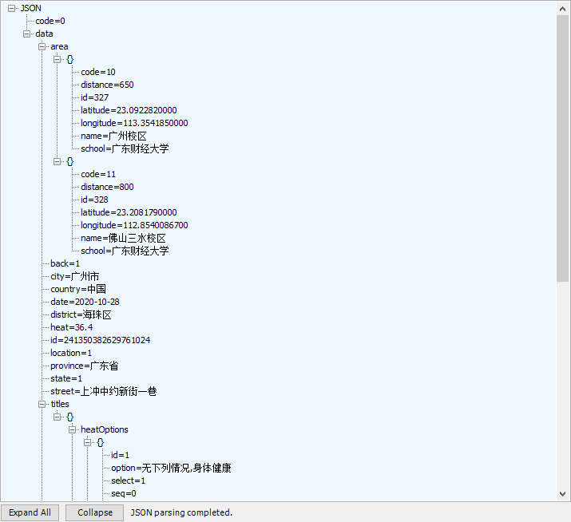


#### 3.获取晚点名信息接口

- 请求路径：sign/getSignMessage.json
- 请求方法：get
- 请求参数

| 参数名 | 参数说明 | 备注  |
| ------ | -------- | ----- |
| page   | 页数     | 默认1 |
| size   | 页大小   | 默认5 |


- 响应参数

| 参数名 | 参数说明   | 备注      |
| ------ | ---------- | --------- |
| code   | 返回状态码 | 0表示成功 |
| data   | 表格数据   |           |
| id     | 用户id     |           |
| logId  | 晚点名id   |           |


#### 4.进行晚点名接口

- 请求路径：sign/doSign.json
- 请求方法：get
- 请求参数

| 参数名 | 参数说明 | 备注 |
| ------ | -------- | ---- |
| logId  | 晚点名id |      |
| id     | 用户id   |      |


- 响应参数

| 参数名 | 参数说明   | 备注      |
| ------ | ---------- | --------- |
| code   | 返回状态码 | 0表示成功 |
| data   | 表格数据   |           |


#### 5.获取未打卡名单接口

- 请求路径：heat/getHeatUsers.json
- 请求方法：post
- 请求参数

| 参数名 | 参数说明 | 备注                    |
| ------ | -------- | ----------------------- |
| seq    | 序列号   | 1：晨检 2：午检 3：晚检 |
| data   | 日期数据 | 格式：YYYYMMDD          |
| type   | 打卡类型 | 0表示未打卡             |

- 响应参数

| 参数名 | 参数说明   | 备注               |
| ------ | ---------- | ------------------ |
| code   | 返回状态码 | 0表示成功          |
| data   | 表格数据   | 所有未打卡人的id号 |


#### 6.代三检接口

- 请求路径：heat/save.json
- 请求方法：post
- 请求参数  （跟进行三检接口一样，只是多了一个参数，且必须是班长才行）

| 参数名 | 参数说明       | 备注 |
| ------ | -------------- | ---- |
| userId | 代三检人的ID号 |      |


### 代码

#### Bean类

`有几个表就有几个实体类`  数据库有 `api_info`  表 和  `user_info` 表 因此就有ApiInfo类和UserInfo类，SignMessage是额外需要就额外添加

**ApiInfo（接口信息类）**

```java
public class ApiInfo {
    @Id
    private Integer id;

    private Integer method;

    private String url;

    private String name;

    private String contenttype;

    private String body;
}
```


**SignMessage（签到信息类）**

```java
public class SignMessage {
    //晚点名 必须带这两参数 
    private String id;
    private String logId;
}
```


**UserInfo（用户信息类）**

```java
public class UserInfo {
    @Id
    private String id;
    private String name;
    private String password;
    private String token;
    private Integer status;
}
```


#### controller层

```java
public class UserController {

    @Resource
    private UserService userService;

    @PostMapping("/register")
    public  Result register(@RequestBody UserInfo userInfo){
        return userService.addUser(userInfo);
    }

    @PostMapping("/login")
    public Result LoginAndUpdate(@RequestBody UserInfo uservo) throws ParseException {
        return userService.updateUser(uservo);
    }

}
```


#### service层

三检过程原理

> 通过`userInfoMapper`查询所有登记了token的用户
> 通过`apiInfoMapper` 查询相应api接口信息
> 然后逐个发送三检


```java
@Service
public class CheckServiceImpl implements CheckService {

    @Resource
    UserInfoMapper userInfoMapper;

    @Resource
    ApiInfoMapper apiInfoMapper;

    @Autowired
    SendUtil sendUtil;

    @Override
    public void morningCheck() {
        List<UserInfo> userList = userInfoMapper.selectAll();
        ApiInfo api = apiInfoMapper.selectOne(new ApiInfo(ApiConstant.TYPE_CHECK));

        for (UserInfo user : userList) {
            sendUtil.sendCheckRequest(user, api, 1);
        }
    }

    @Override
    public void singIn() {
        List<UserInfo> userList = userInfoMapper.selectAll();
        List<ApiInfo> apis = apiInfoMapper.select(new ApiInfo(ApiConstant.TYPE_SIGN_IN));
        ApiInfo signApi = null;
        ApiInfo getSignMessageApi = null;

        for (ApiInfo api : apis) {
            if (api.getName().equals(ApiConstant.GET_SIGN_MESSAGE))
                getSignMessageApi = api;
            else if (api.getName().equals(ApiConstant.DO_SIGN))
                signApi = api;
        }


        for (UserInfo user : userList) {
            SignMessage signMessage = sendUtil.getSignMessage(user, getSignMessageApi);
            sendUtil.sendSignRequest(user, signApi, signMessage);
        }
    }

}
```


#### util包

```java
public class SendUtil {
    /**
     * 发送三检请求
     */
    @Async
    public void sendCheckRequest(UserInfo user, ApiInfo api, int seq) {
        HttpRequest request = createHttpRequest(api);
        //body
        request.body(api.getBody().replace("seq=3", "seq=" + seq));
        //token
        request.header("token", user.getToken());
        //user-agent 具体看源码
        request.header("User-Agent", "M****"");
        //content-type
        request.contentType("application/x-www-form-urlencoded");
        //return body
        request.execute();
    }

    /**
     * 获取签到的id和logId
     */
    public SignMessage getSignMessage(UserInfo user, ApiInfo getSignMessageApi) {
        HttpRequest request = createHttpRequest(getSignMessageApi);
        //token
        request.header("token", user.getToken());
        //user-agent  具体看源码
        request.header("User-Agent");
        //content-type
        request.contentType("application/x-www-form-urlencoded");
        //参数
        request.form("page", 1);
        request.form("size", 5);
        //得到返回的JSON并解析
        String body = request.execute().body();
        //System.out.println(user.getName() + ":" + body);
        JSONObject data = (JSONObject) ((JSONArray) JSONUtil.parseObj(body).get("data")).get(0);
        return new SignMessage((String) data.getObj("id"), (String) data.get("logId"));
    }


    /**
     * 发送签到请求
     */                   
    @Async
    public void sendSignRequest(UserInfo user, ApiInfo signApi, SignMessage signMessage) {
        HttpRequest request = createHttpRequest(signApi);
        //JSON data
        JSONObject data = new JSONObject();
        data.set("id", signMessage.getLogId());
        data.set("signId", signMessage.getId());
        data.set("latitude", "23.090164");
        data.set("longitude", "113.354053");
        data.set("country", "中国");
        data.set("province", "广东省");
        data.set("district", "海珠区");
        data.set("township", "官洲街道");
        data.set("city", "广州市");
        request.body(data.toString());
        //token
        request.header("token", user.getToken());

        request.contentType("application/json");
        request.execute();
    }

    /**
     * 创建HttpRequest对象
     */
    private HttpRequest createHttpRequest(ApiInfo api) {
        HttpRequest request = null;
        //get
        if (api.getMethod().equals(ApiConstant.METHOD_GET))
            request = HttpRequest.get(api.getUrl());
            //post
        else if (api.getMethod().equals(ApiConstant.METHOD_POST))
            request = HttpRequest.post(api.getUrl());
        return request;
    }
}
```


## 拓展篇

### github

#### [将本地项目提交到github](https://jingyan.baidu.com/article/9c69d48fe68cce13c9024e9c.html)


#### [GIT commit问题](https://blog.csdn.net/cr27225/article/details/103520066)


#### [删除多余文件](https://www.cnblogs.com/jackzz/p/10951439.html)

```shell
E:\fuckwzxy>git pull
Already up to date.

E:\fuckwzxy>dir
 驱动器 E 中的卷是 软件
 卷的序列号是 000C-A71F

 E:\fuckwzxy 的目录

2020/11/01  22:54    <DIR>          .
2020/11/01  22:54    <DIR>          ..
2020/11/01  23:53    <DIR>          .idea
2020/10/31  01:34            10,415 fuckwzxy.iml
2020/11/01  22:54    <DIR>          logs
2020/10/31  01:32             2,931 pom.xml
2020/10/31  01:31    <DIR>          src
2020/10/31  01:35    <DIR>          target
               2 个文件         13,346 字节
               6 个目录 115,829,665,792 可用字节

E:\fuckwzxy>git rm -r --cached target
E:\fuckwzxy>git rm -r --cached src/test
E:\fuckwzxy>git rm -r --cached .idea
E:\fuckwzxy>git rm -r --cached logs
E:\fuckwzxy>git rm -r --cached fuckwzxy.iml

E:\fuckwzxy>git commit -m '删除了.idea/logs/target'

E:\fuckwzxy>git push -u origin master

```


#### [配置gitignore](https://my.oschina.net/LevelCoder/blog/1632783?p=1)


### 热部署Devtools

#### 1.Adding devtools to your project

```xml
<dependency>
	<groupId>org.springframework.boot</groupId>
    <arfifactId>spring-boot-devtools</arfifactId>
    <scope>runtime</scope>
    <optional>true</optional>
</dependency>
```


#### 2.Adding plugin to your pom.xml

```xml
<build>
    <plugins>
    	<plugin>
        	<groupId>org.springframework.boot</groupId>
            <artifactId>spring-boot-maven-plugin</artifactId>
            <configuration>
            	<fork>true</fork>
                <addResources>true</addResources>
            </configuration>
        </plugin>
    </plugins>
</build>
```


#### 3.Enabling automatic build


#### 4.Update the value of

按 `ctrl + shirt + Alt +  /`


#### 5.重启IDEA

2019 不用重启 如果不行就重启吧 


[Idea全部快捷键+自行修改快捷键](https://www.cnblogs.com/lovestart/p/12318411.html)


### 项目问题

关于执行异步处理（动态代理）  自己调用自己解决 会出现循环 需要加入@lazy 进行懒加载

[@lazy注解处理循环注入问题](https://www.cnblogs.com/yangxiaohui227/p/10523025.html)


## 最后

感谢你们的使用！也谢谢你们给我提供的反馈！

> 本篇技术支持、服务器提供 是`wzh`  
> 文档书写、vue界面 以及后续优化 是`Dakung  `


